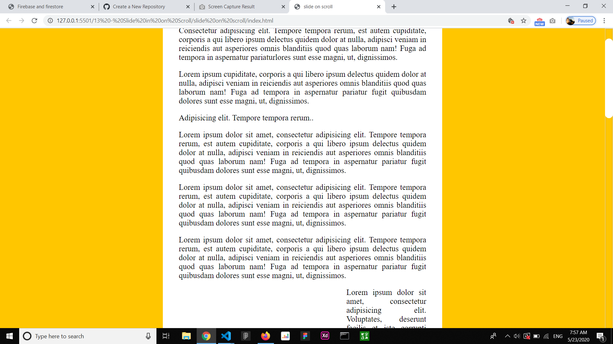

# slider-on-scroll
This is a simple one page website that animates when you scroll down.
 
At first before you scroll the images have  zero opacity to hide them and have a translateX value on the transform property.
 

 
When you scroll down the images slowly appear on the page with a smooth animation.

